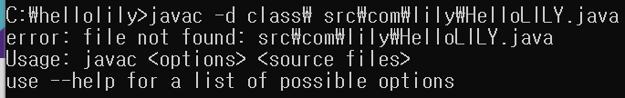
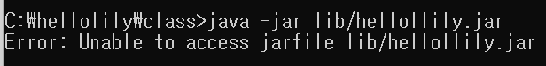
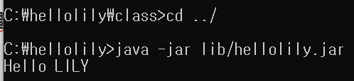
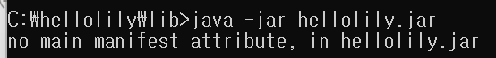

학원에서 Java 수업을 들을 때 커맨드 라인에서 컴파일, 프로그램 실행, 배포를 해보았었는데 컴파일, 빌드, 배포라는 개념을 이해하지 못한 채로 명령어만 따라서 적기 급급했다. 강의에 동일한 부분이 언급되기에 이번 기회에 완전히 이해해보기로 했다.

## #커맨드 라인에서 컴파일 하기

### **컴파일 (Compile)**

- 사용자가 작성한 소스코드 파일(.java)을 컴퓨터가 이해할 수 있는 기계어로 번역한 것
- .java를 .class로 변환하는 것
- 컴파일을 해주는 프로그램을 컴파일이라고 함

커맨드 라인에서 명령어로 컴파일을 해보겠다.

javac -d <컴파일 결과물을 저장할 경로> <컴파일할 .java 파일>

- javac : java complier를 뜻하는 명령어
- .java 파일이 무사히 컴파일 되면 .class 파일이 나옴
    - 이름은 .java 파일과 동일
    - 이 .class 파일에는 바이트 코드가 들어있음 → OS(운영체제)가 아는 실행 파일(.exe)을 주는 것이 아님
- 옵션 : -d
    - .class 파일을 저장할 directory (경로)를 의미
    - <컴파일 결과물을 저장할 경로> 안에 .java 파일의 패키지 구조와 동일한 폴더가 생김
    - .java 파일과 .class 파일이 동일한 폴더 구조를 따름
    
    
    

**주의!** helloLILY.java라고 이름을 저장해도 JAVA파일이 아닌 텍스트 파일 형식으로 되어 있다면 아래와 같은 에러가 발생한다.



## #**프로그램 실행하기**

### **빌드 (Build)**

- 사용자가 작성한 소스코드 파일(.java)을 컴파일해서 컴파일된 코드(.class)가 되면, 이것을 컴퓨터가 실행할 수 있는 상태로 변환하는 것을 빌드라고 함
- 컴퓨터가 실행할 수 있는 상태란 resource를 .class에서 참조할 수 있는 적절한 위치로 옮기고, META-INF와 MANIFEST.MF 들을 jar,war 등의 실행 가능한 파일을 뽑아내기까지의 과정임

커맨드 라인에서 명령어로 프로그램을 실행시켜보겠다.

java -classpath <class 파일 위치> <클래스 이름>

- java : 바이트 코드 (*.class 파일)를 실행하는 명령어
- 옵션 : -classpath
    - .class 파일의 위치를 알려주는 옵션
    - -classpath 다음에 경로를 적음 → 아래의 예시와 같이 패키지를 포함하는 폴더의 경로를 적어야 함 (클래스명만 적을 경우X)
- <class 파일 위치> → .class가 들어가있던 파일 위치
- <클래스 이름>
    - 실행할 .class 파일 이름
    - 이 .class 파일에는 반드시 main 함수가 들어 있어야 함
    - HelloLILY.java
      
        ```jsx
        package com.lily;
        
        public class HelloLILY {
            public static void main(String[] args) {
                System.out.println("Hello LILY");
            }
        }
        ```
        

)

커맨드 라인에서 배포하기 위해 명령어로 jar 파일을 만들어 보겠다.

jar <option> <jar 파일 이름> <최상위 패키지 경로>

- jar : 내가 만든 라이브러리나 프로그램을 배포하기 위해 .jar를 만드는 명령어 → class 상위 폴더로 lilb 폴더 생성한 후 명령어 실행할 것
- 옵션 : -cf
    - c : create (생성)
    - f : 만들어질 .jar 파일의 이름을 지정 → f 뒤에 파일명이 와야 함
      
        
        

현재의 .jar 파일은 단순히 .zip 파일에 불과하고 java(실행 프로그램)에게 시작점(Entry Point)인 메인 함수에 대한 정보를 알려주지 않았으므로 실행이 되지 않고 아래와 같이 오류가 발생한다.



### **META-INF 폴더 & Manifest 파일**

- .jar 파일 내부를 보면 META-INF\MANIFEST.MF라는 파일이 있음
- Manifest 파일
    - 자바 애플리케이션의 정보를 담고 있는 메타데이터 파일
    - .jar를 만들 때 같이 생성되는 파일로, 내가 만들어서 넣을 수도 있음
    - .jar 파일의 시작점(메인 함수)에 대한 정보를 넣어야함
    - 그 밖의 다른 정보들도 넣을 수 있음
- Mainfest 파일 만들기
    - src 폴더 밑에 Mainfest.txt 파일을 만듦
    - 어떤 클래스에 메인 함수가 있는지 적어서 알려줌
      
        
        
    

다시 커맨드 라인에서 .jar 파일을 만든다.


- 추가된 옵션 : m
    - .jar 파일을 만들 때 Mainfest 파일도 함께 넣겠단 의미 (Manifest 파일 위치도 함께 알려줌)
    

주의! 파일 이름을 Manifest만 입력해야 함 → 그렇지 않을 경우 Mainfest.txt.txt로 읽어 원하는 파일을 찾아가지 못해 아래와 같이 에러가 발생함


다시 커맨드 라인에서 .jar 파일을 실행한다.

- 옵션 : -jar : .jar 파일 실행
    - .jar 파일 안에 있는 Mainfest 파일 안에서 어떤 클래스에 메인 함수가 있는지 알기 때문에 찾아서 실행을 해줌



주의! Mainfest.txt 파일에 Class-Path: com.lily.HelloLILY 와 같이 입력한 후 Enter를 입력하지 않으면 공백이 없어 인식을 하지 못해 아래와 같은 에러가 발생할 수 있음



## #배포하기

### **배포 (Deploy)**

- 빌드가 완성된 실행 가능한 파일을 사용자가 접근할 수 있는 환경에 배치시키는 일
- 빌드를 통해 뽑아낸 war 파일을 웹서버에 올리거나 exe. jar 파일을 사용자에게 주는 것을 배포한다고 함

### #참조

위 글은 Pope Kim님의 개체지향 프로그래밍 및 설계(Java)를 듣고 작성한 글입니다. 

[](https://www.udemy.com/course/object-oriented-programming-and-design-by-pocu/)
